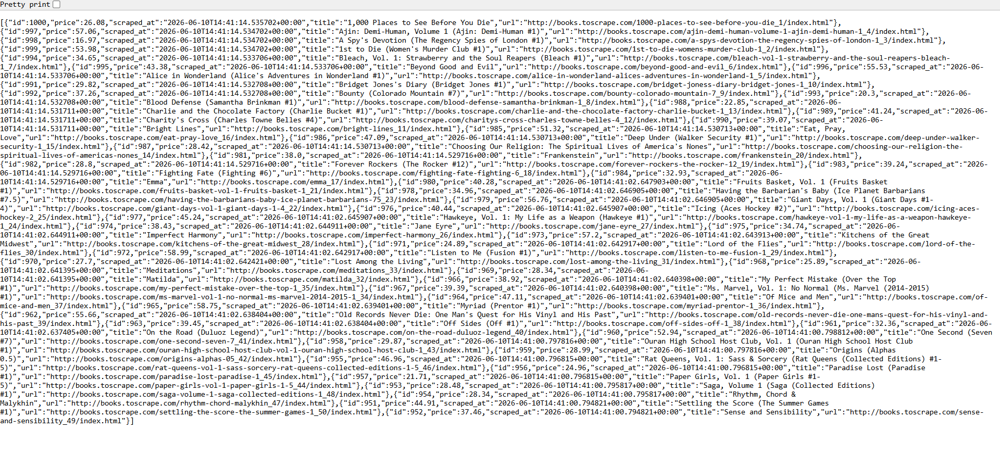

# Book Scraper + REST API (Python / Flask)

## 🌐 Live API

**Base URL**: https://book-scraper-dfvt.onrender.com

> **Note:** The free instance may take 30-60 seconds to wake up on the first request.

---

## 🧪 Testing the Live API

1. Open your browser or use a tool like [Hoppscotch](https://hoppscotch.io) or Postman
2. Try these endpoints directly in your browser:

**Get all books:**
https://book-scraper-dfvt.onrender.com/books

**Filter by price (books under £20):**
https://book-scraper-dfvt.onrender.com/books?max_price=20

**Limit results:**
https://book-scraper-dfvt.onrender.com/books?limit=5

**Combine filters:**
https://book-scraper-dfvt.onrender.com/books?max_price=15&limit=3

**Stats endpoint:**
https://book-scraper-dfvt.onrender.com/books/stats

---

## 📌 Description

A production-structured web scraper that crawls all 1,000 books across 50 pages from [books.toscrape.com](http://books.toscrape.com), stores the data in SQLite, and exposes it through a queryable Flask REST API.
Built with a clean three-stage architecture — Fetch → Parse → Store — with retry logic, deduplication, pagination handling, and a background scheduler to keep data fresh automatically.

---

## 🚀 Features

- Scrapes all 1,000 books across 50 paginated pages automatically
- Follows "next" page links dynamically — no hardcoded page count
- Retry logic with delays — handles flaky network responses gracefully
- Deduplication at the database level via UNIQUE constraint on URL
- Prices stored as REAL (float) — enables numerical filtering and sorting
- Background scheduler re-scrapes every 6 hours automatically
- REST API with filtering by price, sorting, and stats endpoint
- Clean separation of fetcher, parser, storage, and API layers

---

## 🛠 How to Run

1. Clone the repository
2. Create and activate a virtual environment:
```bash
python -m venv venv
venv\Scripts\activate        # Windows
source venv/bin/activate     # Mac/Linux
```
3. Install dependencies:
```bash
pip install -r requirements.txt
```
4. Run the app:
```bash
python run.py
```
5. The scraper runs immediately on startup, then every 6 hours. API available at `http://127.0.0.1:5001`

---

## 🔗 API Endpoints

| Method | Endpoint | Description |
|--------|----------|-------------|
| GET | `/books` | Get all scraped books |
| GET | `/books?max_price=20` | Filter books under a price |
| GET | `/books?limit=10` | Limit number of results |
| GET | `/books/stats` | Top books by price stats |

### Example Response — `GET /books?max_price=20&limit=3`
```json
[
  {
    "id": 11,
    "title": "Starving Hearts (Triangular Trade Trilogy #1)",
    "price": 13.99,
    "url": "http://books.toscrape.com/catalogue/starving-hearts...",
    "scraped_at": "2026-06-10T14:41:14.535702+00:00"
  }
]
```

---

## 📂 Project Structure

```
job-scraper/
│
├── scraper/
│   ├── __init__.py
│   ├── fetcher.py      # HTTP requests with retry logic
│   ├── parser.py       # HTML → structured data + pagination
│   └── storage.py      # SQLite insert with deduplication
│
├── api/
│   ├── __init__.py
│   └── app.py          # Flask REST API
│
├── run.py              # Entry point + APScheduler
└── requirements.txt
```

---

## 🛠 Tech Stack

- Python
- Flask
- BeautifulSoup4
- SQLite
- APScheduler
- Requests

---

## 🏗 Architecture

The scraper is split into three independent, testable stages:

```
[Fetch]  →  [Parse]  →  [Store]
fetcher.py  parser.py  storage.py
```

- **Fetcher** — handles HTTP only. Retries 3 times with delay on failure. Spoofs a real browser User-Agent.
- **Parser** — receives raw HTML, returns clean Python dicts. Knows nothing about HTTP or databases.
- **Storage** — inserts records, skips duplicates silently via SQLite UNIQUE constraint.

This separation means any layer can be swapped or tested independently — for example, swapping the target site only requires changing CSS selectors in `parser.py`.

---

## 📚 What I Learned

- Web scraping with BeautifulSoup4
- Handling pagination by following next-page links dynamically
- Retry logic and polite scraping (rate limiting with delays)
- robots.txt and scraping ethics
- Storing scraped data with proper types (REAL for prices)
- Deduplication at the database level
- Dynamic SQL query building with filters
- Background task scheduling with APScheduler
- Separating concerns across fetch, parse, and store layers
- Using `urljoin` to resolve relative URLs correctly
- Timezone-aware datetimes with `datetime.now(timezone.utc)`

---

## 📸 Screenshots

### Result
